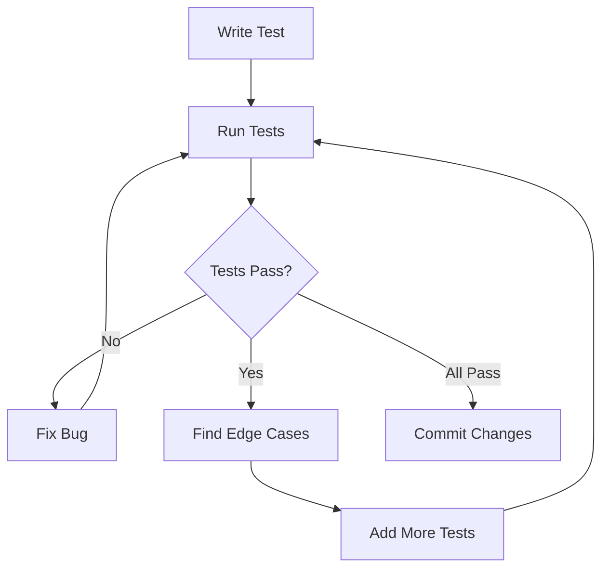

# Continuing Development - TDD Workflow

This guide explains how to continue developing CurlDotNet using Test-Driven Development (TDD).

## TDD Workflow

The core principle: **Run tests → Fix bugs → Run tests again → Find edge cases → Run tests again**

### The Cycle



## Daily Workflow

### 1. Run All Tests

```bash
cd tests/CurlDotNet.Tests
dotnet test --verbosity normal
```

**What to look for:**
- ✅ All tests pass
- ⚠️ Warnings (fix non-critical ones later)
- ❌ Failures (fix immediately)

### 2. Fix Failures

When a test fails:

1. **Read the error message carefully**
2. **Reproduce the issue** - Run just that test:
   ```bash
   dotnet test --filter "FullyQualifiedName~TestName"
   ```
3. **Fix the bug** in the source code
4. **Run tests again** to verify the fix
5. **Check for regressions** - Run all tests

### 3. Add Edge Case Tests

Think about what could go wrong:

- **Input variations**: Empty strings, null values, special characters
- **Boundary conditions**: Max values, zero, negative numbers
- **Error scenarios**: Network failures, timeouts, malformed input
- **Cross-platform**: Windows vs macOS vs Linux differences
- **Real-world commands**: Actual curl commands from API docs

**Example:**
```csharp
[Theory]
[InlineData("")]
[InlineData("   ")]
[InlineData(null)]
public void Parse_EmptyCommand_ShouldThrow(string command)
{
    // Test edge cases
}
```

### 4. Test-Driven Development

When adding a new feature:

1. **Write a test first** that fails
2. **Implement minimal code** to make it pass
3. **Refactor** if needed
4. **Add more tests** for edge cases
5. **Repeat**

### 5. Command-Line Comparison Tests

These tests compare CurlDotNet output with actual curl binary:

```bash
# These tests run on macOS/Linux
dotnet test --filter "Category=CommandLineComparison"
```

**Note:** These require:
- curl binary installed
- macOS or Linux (ZSH/Bash)
- Network access

They verify parity with the real curl binary.

## Running Specific Tests

### By Category

```bash
# Run all parser tests
dotnet test --filter "Category=Parser"

# Run integration tests
dotnet test --filter "Category=Integration"

# Run synthetic tests
dotnet test --filter "Category=Synthetic"

# Skip command-line comparison tests (if on Windows)
dotnet test --filter "Category!=CommandLineComparison"
```

### By Name

```bash
# Run specific test
dotnet test --filter "FullyQualifiedName~SimpleGet_CompareWithCurl"

# Run all tests in a class
dotnet test --filter "FullyQualifiedName~CommandParserTests"
```

### With Coverage

```bash
dotnet test /p:CollectCoverage=true /p:CoverletOutputFormat=opencover
```

Coverage reports are generated in `TestResults/` directory.

## Test Categories

Tests are categorized for easy filtering:

- **CurlUnit**: Unit tests for core functionality
- **Parser**: Command parser tests
- **Integration**: Integration tests requiring network
- **Synthetic**: Synthetic/comprehensive tests
- **CommandLineComparison**: Tests comparing with curl binary
- **RequiresNetwork**: Tests that need internet access

## Building Documentation

### Manual Documentation

The `/manual` folder contains markdown documentation:

- Add new tutorial files following the existing structure
- Use Mermaid diagrams for visual explanations
- Include code examples for every concept
- Link between pages using relative paths

**Creating a new tutorial:**
1. Create a new `.md` file in `manual/tutorials/`
2. Add it to `manual/README.md` TOC
3. Include examples, diagrams, and cross-references

### DocFX Documentation

Generate API documentation:

```bash
docfx docfx.json
```

Output is in `_site/`

## Common Issues and Fixes

### Issue: Tests fail with "No URL specified"

**Fix:** Ensure test commands include a valid URL:
```csharp
var options = _parser.Parse("curl https://example.com");
// Not: var options = _parser.Parse("curl");
```

### Issue: Nullability warnings

**Fix:** Add null checks or make properties nullable:
```csharp
public string? StandardOutput { get; set; }
```

### Issue: Command-line comparison tests fail on Windows

**Fix:** These tests are Unix-only. Skip on Windows:
```csharp
if (!IsUnix)
{
    throw new SkipException("Requires Unix");
}
```

### Issue: Tests time out

**Fix:** Increase timeout or use faster test endpoints:
```csharp
var result = await Curl.ExecuteAsync(
    "curl --max-time 10 https://httpbin.org/get"
);
```

## Commit Workflow

### Before Each Commit

1. ✅ Run all tests: `dotnet test`
2. ✅ Fix any failures
3. ✅ Build solution: `dotnet build`
4. ✅ Check for warnings (fix critical ones)
5. ✅ Update documentation if needed

### Commit Message Format

```
Short summary (50 chars max)

Detailed explanation if needed:
- What changed
- Why it changed
- Any breaking changes

Fixes #123
Closes #456
```

**Example:**
```
Fix command parser handling of escaped quotes

Improved quote escaping logic to handle Windows-style
escaped quotes (""). Added tests for cross-platform
compatibility.

Fixes quote parsing issues on Windows CMD.
```

### Commit Frequency

- **After fixing each bug** - Small, focused commits
- **After adding features** - With tests
- **After significant refactoring** - When tests pass
- **At end of day** - If you have uncommitted work

## Continuous Improvement

### Code Coverage Goal

**Target: 90%+ coverage**

Check coverage:
```bash
dotnet test /p:CollectCoverage=true
```

If below 90%:
1. Identify uncovered code
2. Write tests for it
3. Re-run coverage check

### Performance Testing

Run benchmarks (if configured):
```bash
cd benchmarks
dotnet run -c Release
```

### Documentation Updates

Keep documentation in sync with code:
- Update examples when APIs change
- Add new tutorials for new features
- Fix broken links
- Update diagrams when architecture changes

## Using Your Development Environment

### Recommended Setup

- **Editor**: Visual Studio Code, Visual Studio, or Rider
- **Terminal**: ZSH (macOS) or PowerShell/Bash (Windows)
- **Git**: Configured with your GitHub credentials
- **.NET SDK**: .NET 8 SDK installed

### Git Configuration

```bash
# Set your name and email (if not already set)
git config --global user.name "jacob-mellor"
git config --global user.email "your-email@example.com"

# Verify
git config --global --list
```

### Useful Git Aliases

```bash
# Quick status
git config --global alias.st status

# Short log
git config --global alias.lg "log --oneline --graph --decorate"

# Quick commit (use with caution!)
git config --global alias.ci commit
```

## Next Steps

After committing:

1. **Push to GitHub:**
   ```bash
   git push origin dotnetcurl
   ```

2. **Continue Documentation:**
   - Add more tutorial files to `manual/`
   - Create examples for all major curl tasks
   - Add Mermaid diagrams for complex workflows

3. **Iterate on Tests:**
   - Add more edge case tests
   - Improve command-line comparison tests
   - Add performance benchmarks

4. **Prepare for NuGet:**
   - See `NUGET_PUBLISHING.md`
   - Test package locally
   - Prepare release notes

---

**Remember:** The TDD cycle is your friend. Run tests frequently, fix bugs immediately, and keep iterating!

