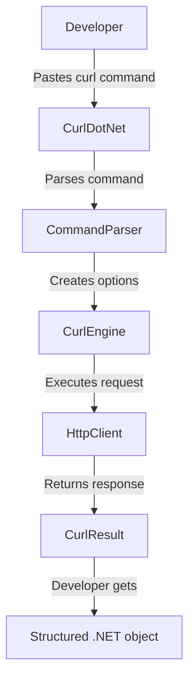

# Introduction to CurlDotNet

## What is CurlDotNet?

**CurlDotNet** is a pure .NET implementation of curl, allowing you to execute curl commands directly in your C# applications. No translation, no shell execution—just paste your curl command and run it.



## Why Use CurlDotNet?

### ✂️ Copy & Paste Magic

Every API documentation shows curl examples. With CurlDotNet, you can use those exact commands:

```csharp
// From GitHub API docs - paste it directly!
var result = await Curl.ExecuteAsync(
    @"curl -X POST \
      -H ""Accept: application/vnd.github+json"" \
      -H ""Authorization: Bearer YOUR_TOKEN"" \
      https://api.github.com/repos/OWNER/REPO/issues"
);
```

### 🎓 Zero Learning Curve

If you know curl (and everyone does), you already know CurlDotNet. No new APIs to learn.

### 🔄 Easy Migration

Move from bash scripts to C# without rewriting:

```bash
# Bash script
curl -X POST -H "Content-Type: application/json" -d '{"key":"value"}' https://api.example.com
```

```csharp
// C# - same command!
var result = await Curl.ExecuteAsync(
    @"curl -X POST -H ""Content-Type: application/json"" -d '{""key"":""value""}' https://api.example.com"
);
```

### 📦 All 300+ Curl Options

Every curl option is supported. Headers, authentication, cookies, redirects, SSL, proxies—everything works.

## Three Ways to Use CurlDotNet

CurlDotNet provides three APIs for different use cases:

### 1. **Curl String API** (Simplest)

Perfect when you have curl commands from documentation:

```csharp
var result = await Curl.ExecuteAsync("curl https://api.example.com");
```

**Use when:**
- You have curl commands from API docs
- Quick one-off requests
- Prototyping and testing

### 2. **Fluent Builder API** (Type-Safe)

Build requests programmatically with IntelliSense:

```csharp
var result = await CurlRequestBuilder
    .Get("https://api.example.com")
    .WithHeader("Accept", "application/json")
    .WithBearerToken("token123")
    .ExecuteAsync();
```

**Use when:**
- Building requests dynamically
- Need type safety and IntelliSense
- Prefer programmatic APIs

### 3. **LibCurl API** (Reusable)

Object-oriented API for reusable clients:

```csharp
using (var curl = new LibCurl())
{
    curl.WithHeader("Accept", "application/json")
        .WithBearerToken("token123");
    
    var user = await curl.GetAsync("https://api.example.com/user");
    var posts = await curl.GetAsync("https://api.example.com/posts");
}
```

**Use when:**
- Making multiple requests with same config
- Building HTTP clients
- Need persistent configuration

## Quick Example

Here's a complete example showing all three approaches:

```csharp
using CurlDotNet;
using CurlDotNet.Core;
using CurlDotNet.Lib;

// 1. Curl String (simplest)
var result1 = await Curl.ExecuteAsync(
    "curl -H 'Accept: application/json' https://api.github.com/users/octocat"
);

// 2. Fluent Builder (type-safe)
var result2 = await CurlRequestBuilder
    .Get("https://api.github.com/users/octocat")
    .WithHeader("Accept", "application/json")
    .ExecuteAsync();

// 3. LibCurl (reusable)
using (var curl = new LibCurl())
{
    var result3 = await curl
        .WithHeader("Accept", "application/json")
        .GetAsync("https://api.github.com/users/octocat");
}

// All return the same CurlResult object!
Console.WriteLine(result1.Body);  // JSON response
Console.WriteLine(result1.StatusCode);  // 200
```

## What CurlDotNet Is NOT

- ❌ **Not a wrapper around the curl binary** - It's pure .NET, no shell execution
- ❌ **Not just an HttpClient wrapper** - It transpiles curl's C source code logic
- ❌ **Not a command-line tool** - It's a library for .NET applications

## What's Next?

- [Compatibility Matrix](04-Compatibility-Matrix.md) – Confirm your target runtime, Unity build, or Azure Functions SKU is supported before deploying.
- [Microsoft & .NET Foundation](02-Microsoft-And-DotNet-Foundation.md) – Shareable rationale for architects, procurement, and InfoSec reviewers.
- [LibCurl Playbook](05-LibCurl-Playbook.md) – Learn how to turn this API into reusable service clients with shared defaults, retries, and diagnostics.
- [docs/ADVANCED.md](../docs/ADVANCED.md) – Deep dive into middleware, protocol handlers, and engine extensibility.
- [Official curl tutorial](https://curl.se/docs/tutorial.html) – Refresh curl CLI semantics; every flag maps 1:1 inside CurlDotNet.

---

**Next:** [Compatibility Matrix →](04-Compatibility-Matrix.md)

